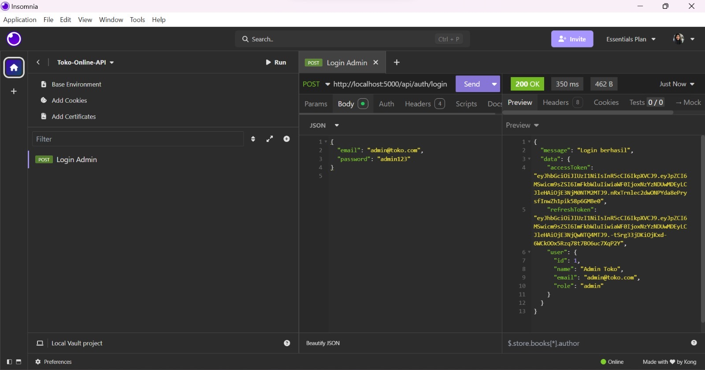
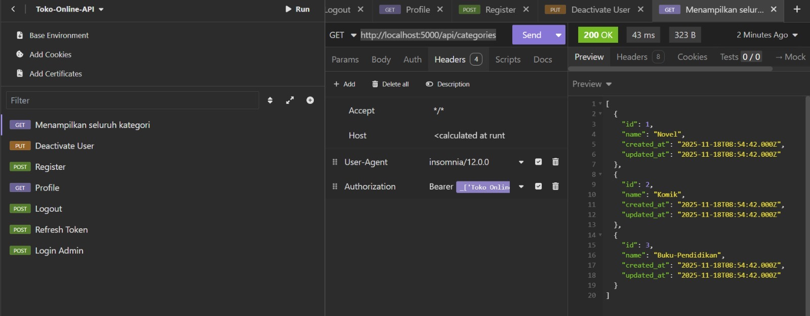
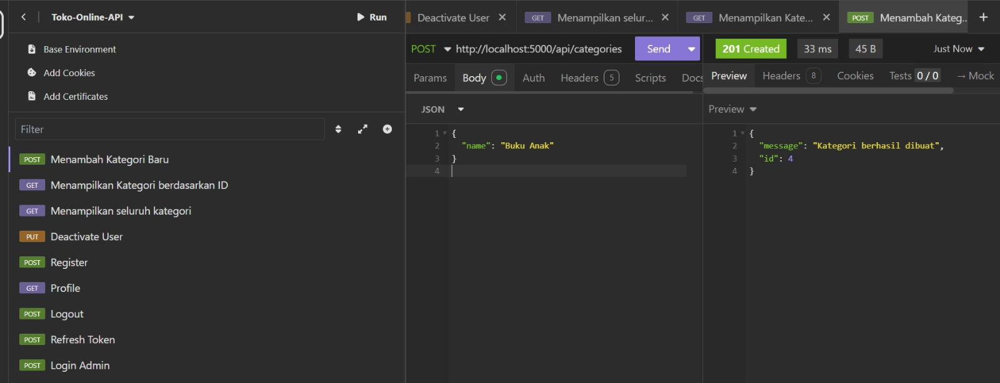
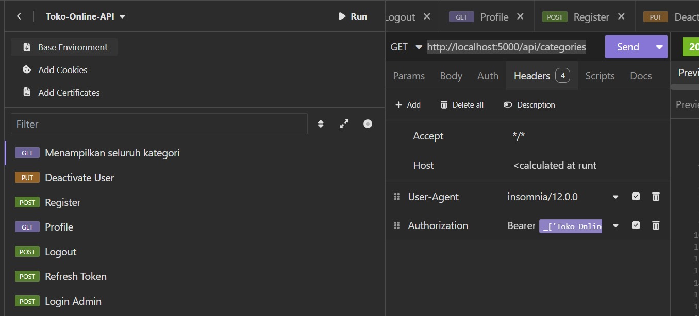

# 🛒 Toko Online REST API

A production-style REST API built using Express.js and MySQL, implementing JWT authentication, refresh token flow, and role-based access control.

## 🚀 Features

* 🔐 JWT Authentication (Access Token & Refresh Token)
* 🔄 Secure Refresh Token Flow
* 👥 Role-Based Access Control (Admin & Cashier)
* 🗄️ Relational Database with Foreign Keys & Constraints
* 📦 Full CRUD for Products, Categories, and Transactions
* 🧪 API Testing using Insomnia

## 🛠️ Tech Stack

* Node.js
* Express.js
* MySQL
* JSON Web Token (JWT)
* Insomnia (API Testing)

## 🗄️ Database Design

Main tables:

* users (admin & cashier roles)
* categories
* products
* transactions
* transaction_items
* refresh_tokens

Relational structure with:

* Foreign keys
* Constraints
* Referential integrity

## 🔐 Authentication Flow

* Login generates:

  * Access Token (1 hour expiry)
  * Refresh Token (7 days expiry)
* Access Token used for protected routes
* Refresh Token used to generate new access tokens
* Secure token storage in database

## 📡 API Endpoints

### Auth

* POST /auth/login
* POST /auth/refresh-token
* POST /auth/logout

### Users (Admin)

* GET /profile
* POST /register
* PUT /deactivate-user

### Categories (Admin)

* GET /categories
* GET /categories/:id
* POST /categories
* PUT /categories/:id
* DELETE /categories/:id

### Products (Admin)

* GET /products
* GET /products/:id
* POST /products
* PUT /products/:id
* DELETE /products/:id

### Transactions (Cashier)

* GET /transactions
* GET /transactions/:id
* POST /transactions
* PUT /transactions/:id

## 🧪 API Testing

* Tested using Insomnia
* Environment variables:

  * base_url
  * accessToken
  * refreshToken

Validated:

* Role-based authorization
* Token expiration handling
* Refresh token flow
* Data consistency

## 📸 API Preview

## 📈 Future Improvements

* API documentation with Swagger
* Docker containerization
* Payment gateway integration
* Rate limiting & security hardening

## 👩‍💻 Author

Made with ❤️ by Your Name

---

## 🤝 Let's Connect!

I'm always open to discussions, collaborations, or feedback 🚀

💌 Linktr.ee: https://linktr.ee/qonitaqq
